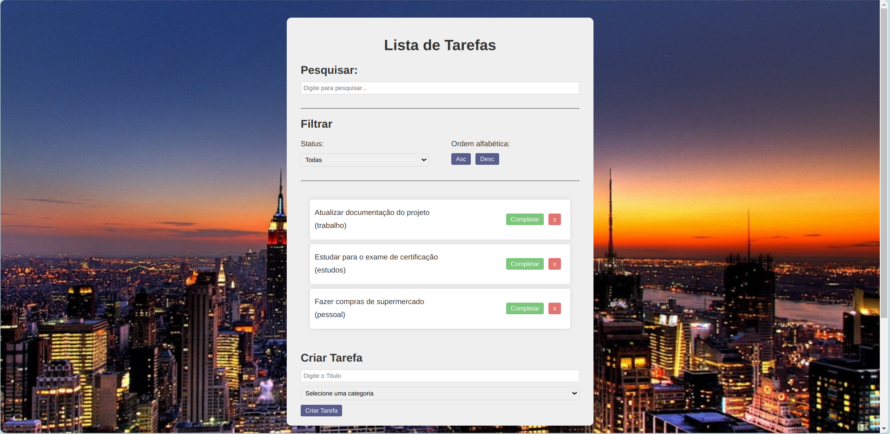

# To-Do-List

## Descrição

Esta To-Do-List foi criada em React, após obter inspiração do curso "Faça uma To Do List" do Matheus Battisti. Utilizando os conceitos aprendidos, o projeto visa praticar e solidificar conhecimentos em React, além de oferecer uma ferramenta prática para organizar tarefas do dia a dia.

##  Site
[Acesse o site aqui!](https://to-do-list-peach-nu.vercel.app/)

## Funcionalidades

- Adição de tarefas
- Remoção de tarefas
- Marcação de tarefas como completas ou incompletas
- Filtro de tarefas por status (completas, incompletas ou todas)
- Ordenação alfabética das tarefas
- Pesquisa de tarefas por texto

## Motivação

Este projeto foi desenvolvido como uma maneira de aprender React e aprimorar os conhecimentos na biblioteca. Ele apresenta uma série de funcionalidades úteis, oferecendo uma experiência de usuário agradável e eficiente para a organização das tarefas diárias.

## Tecnologias Utilizadas

- **React:** Utilizado para construir a interface de usuário interativa.
- **JavaScript:** Linguagem de programação principal do projeto.
- **CSS:** Utilizado para estilizar a aplicação.
- **Vite:** Ferramenta de construção rápida e moderna para projetos web.
- **useState:** Hook do React utilizado para gerenciar estados locais.
- **Filter, Map, Sort:** Funções de array do JavaScript utilizadas para manipular e processar listas de tarefas.

## Autor

- [Robson Mendes](https://github.com/RobsonMendes37)

## Licença

Este projeto está sob a licença MIT. Consulte o arquivo [LICENSE](LICENSE) para mais informações.
